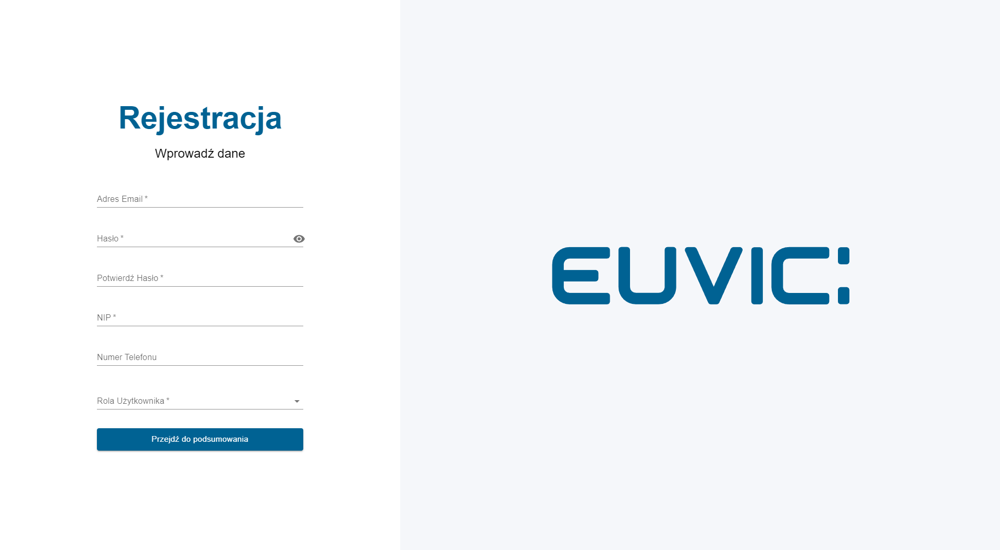

# Registration Module

[](https://reactjs.org/)
[](https://www.typescriptlang.org/)
[](https://mui.com/)
[](https://react-hook-form.com/)
[](https://github.com/jquense/yup)

A simple, user-friendly and fully responsive registration module built using React 18, TypeScript 5, MUI 5, React Hook Form 7, and Yup. This project features a two-step registration form with various required and optional fields and a summary window to review the inputted information. It was written for as recruitment task for an internship at Euvic.



## Table of Contents

- [Features](#features)
- [Demo](#demo)
- [Installation](#installation)
- [Usage](#usage)

## Features

- Two-step registration form
  - Step 1: Email, Password, Confirm Password, NIP Number, Select Role, and an optional Phone Number field
  - Step 2: Summary window with a "view-only" mode for the inputted information
- Ability to go back and edit the data
- Animated loading icon after submitting the form
- Error message displayed after the loading icon (as there is no backend API integration)

## Demo


## Installation

To get started, clone the repository and install the dependencies:

```bash
git clone https://github.com/WoXuS/registration-module.git
cd registration-module
npm install
```

## Usage

To start the development server, run:
```bash
npm start
```

Open http://localhost:3000 to view the registration module in your browser.